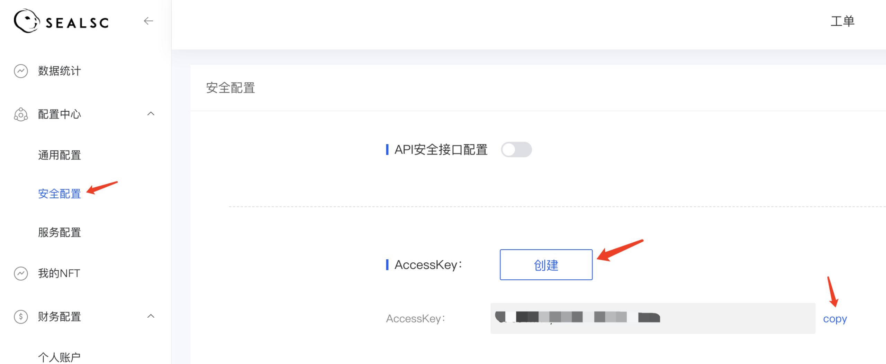

# 安全配置-AccessKey
1. 介绍： 

    AccessKey：用于验证用户的密钥。AccessKey必须保密
    
    **(AccessKey泄露会威胁您所有资源的安全。请妥善保存)**
    
2. 操作步骤：  

    ①　以SEALSC账号登录控制台。

    ②　进入【配置中心】-【安全配置】，单击AccessKey后的创建按钮。
    

    ③　获取账号AccessKey

    ④　可查看保存

