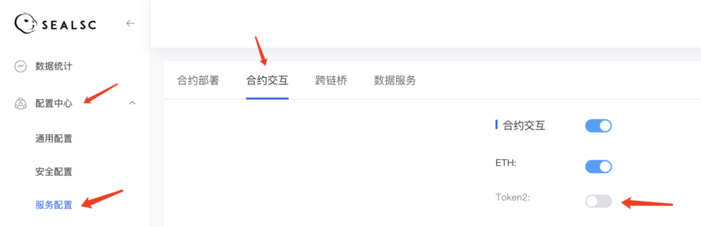

# 服务配置-合约交互
1. 介绍： 

    合约交互为系统内合约支持的部分功能，购买之后有合约的用户可通过API接口调用，没有合约的用户需先部署合约
    
2. 操作步骤：  

   ①　开通合约交互服务之后进入控制台

   ②　进入【配置中心】-【服务配置】-【合约交互】模块内

   ③　默认展示合约交互功能是关闭状态

   ④　点击合约交互后的开关按钮可选择全部开启
   

   ⑤　可选择某一交互的开关按钮单独开启
   
   ⑥　配置API接口完成后在该位置开启合约交互服务，个人平台的可用；
       在该位置关闭某本合约，该合约服务个人平台不可用。【前提：有合约可调用交互服务】
   

