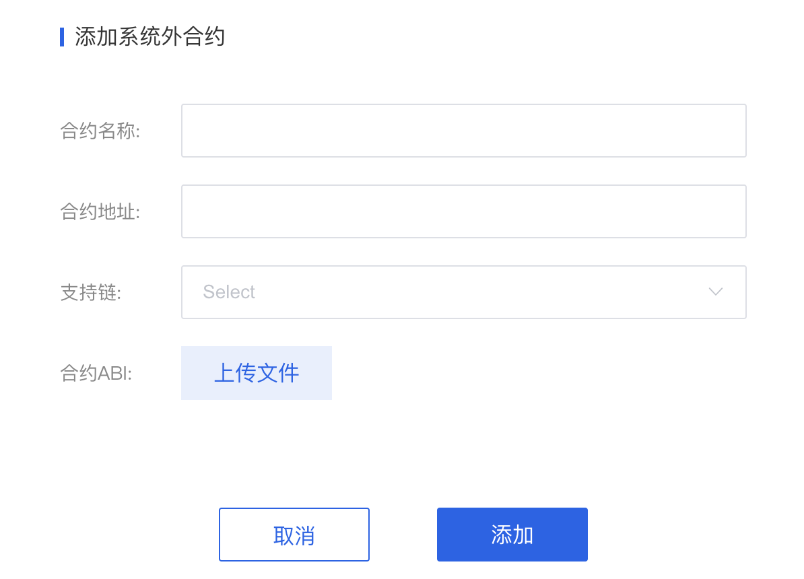
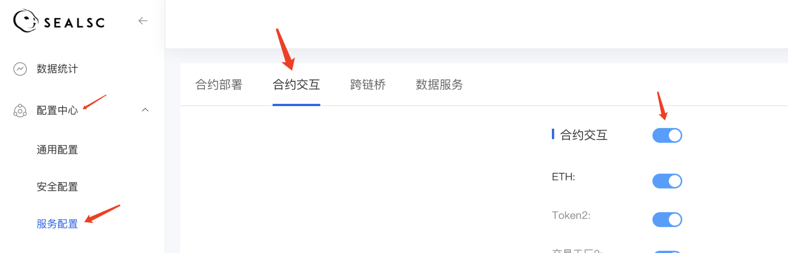

# 服务配置-系统外合约交互
1. 介绍： 

    该模块可上传系统内没有的交互服务，XaaS系统支持部分外部合约交互，上传完成之后，服务可通过系统控制台控制开关
    
2. 操作步骤：  

   ①　开通合约交互服务之后进入控制台

   ②　进入【配置中心】-【服务配置】-【合约交互】模块内

   ③　点击添加系统外部合约，填入全部参数
    

   ④　提交之后信息会展示在列表中，可在列表中查看添加成功与失败状态

       注：系统支持部分外部合约交互，此处失败状态为：系统不支持该交互 

   ⑤　添加成功之后该服务会出现在合约交互中，可控制开关
   