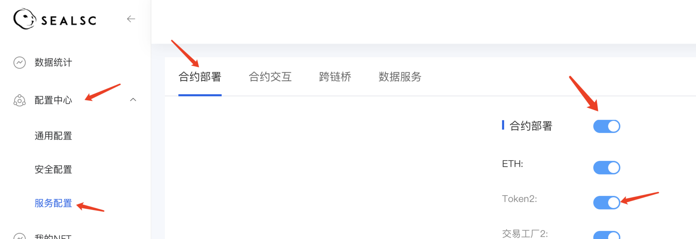

# 服务配置-合约部署
1. 介绍： 

    合约部署为：标准合约部署服务，开通服务之后可在此处控制服务的启用和禁用
    
2. 操作步骤：  

   ①　开通合约部署服务之后进入控制台

   ②　进入【配置中心】-【服务配置】-【合约部署】模块内

   ③　默认展示合约部署功能是关闭状态

   ④　点击合约部署后的开关按钮可选择全部开启
   

   ⑤　可选择某一合约的开关按钮单独开启
   
   ⑥　配置API接口完成后在该位置开启合约部署服务，个人平台可用；关闭某本合约，个人平台不可用
   

