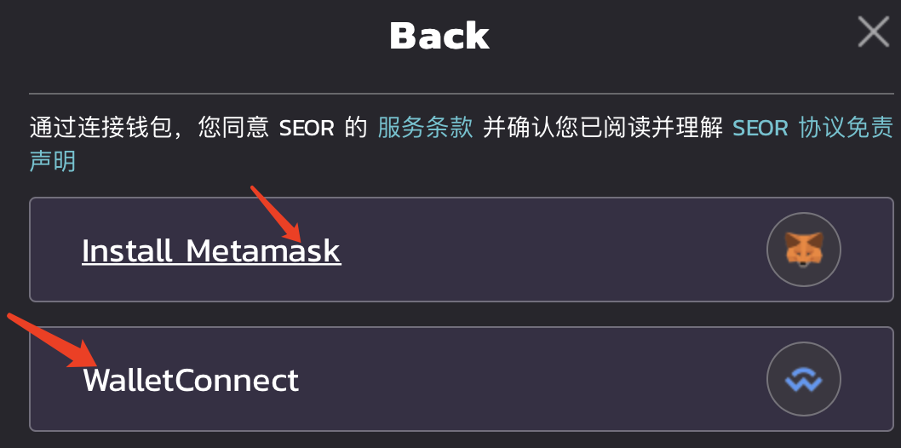

# 财务配置-个人账户
1. 介绍：
   
    该模块服务展示个人账户额度，可在该位置进行充值
    
2. 操作步骤：  

    ①   登录进入控制台

    ②   进入【财务配置】-【个人账户】

    ③   输入充值金额，再次确定充值金额

    ④   点击充值按钮调用钱包，若是检测到用户未安装钱包，则会提示下载

    ⑤   无钱包： 可到<https://metamask.io>下载钱包后注册登录，或者用手机钱包扫描二维码登录
    

    ⑥   不想下载钱包或需要合作的用户，可点击联系客服，申请代充服务，代充无需您操作任何事项，直冲到账

    ⑦   登录钱包后进行充值，签名确认等流程后，充值成功

