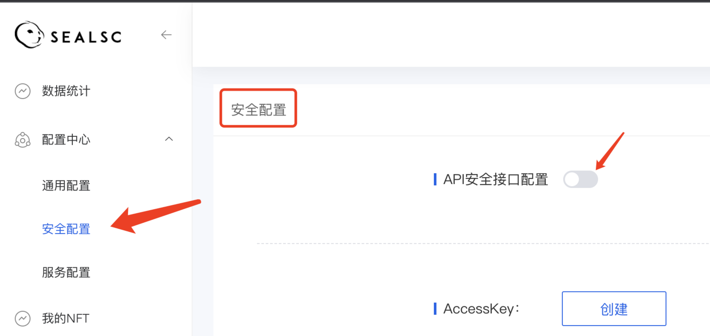
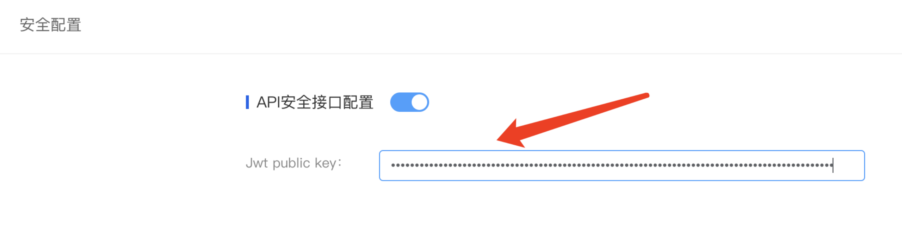

# 安全配置-Jwt
1. [jwt简介](https://jwt.io/introduction?spm=a2c4g.11186623.0.0.73e4640dGU5mB4)
    
2. 操作步骤：  

    ①　进入【控制台】-【配置中心】-【安全配置】中，打开API安全接口配置
    

    ②　 自行生成jwt（参考网站：<https://jwt.io/>）填入点击配置
    

    ③　配置完成之后想要修改可点击重置按钮

